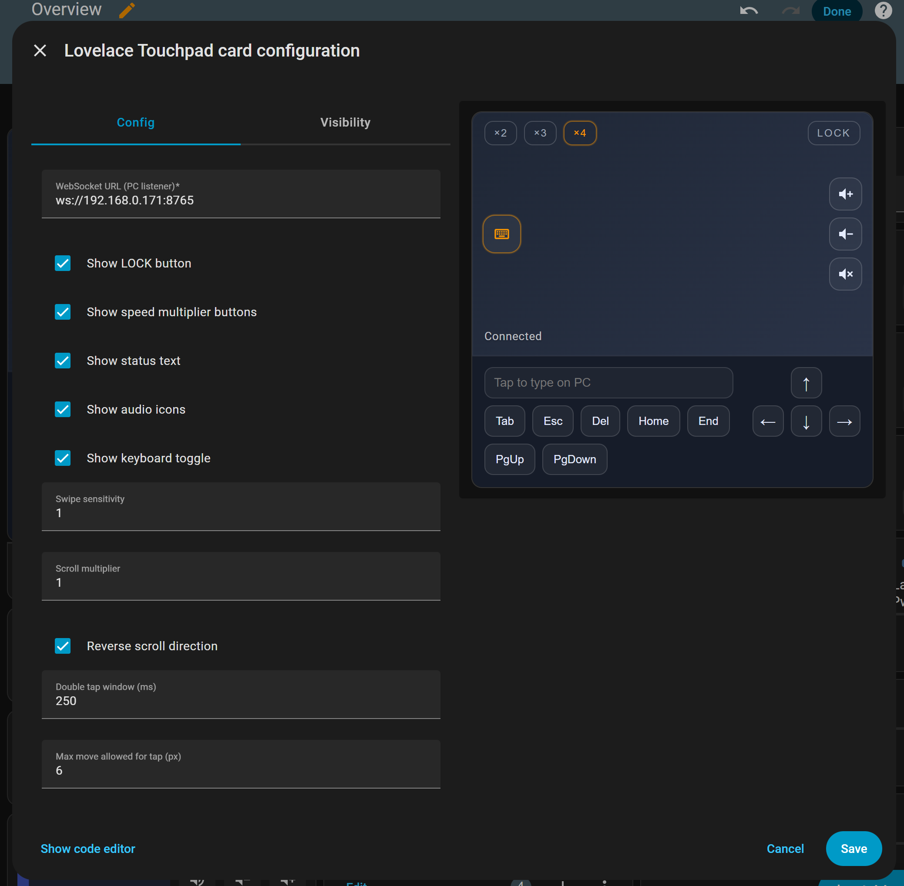
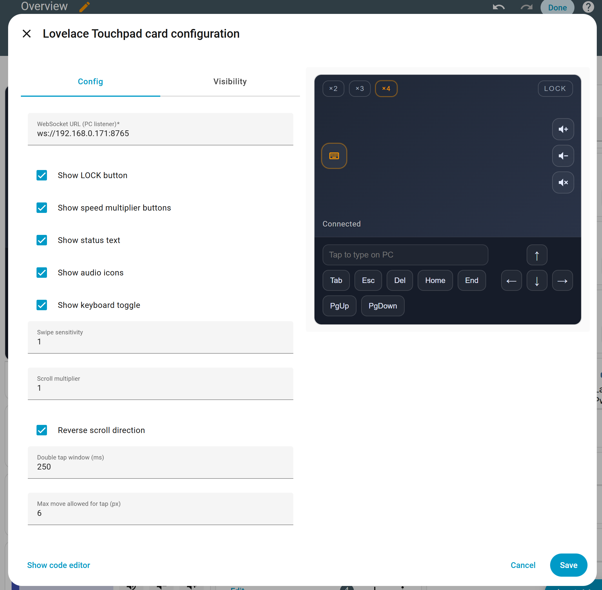

[](https://my.home-assistant.io/redirect/hacs_repository/?owner=michalowskil&repository=lovelace-touchpad-card&category=plugin)
[](https://github.com/michalowskil/lovelace-touchpad-card/releases)
[](https://github.com/michalowskil/lovelace-touchpad-card/releases/latest)

# Lovelace Touchpad Card for Home Assistant

Use this card like a real touchpad to control your PC from Home Assistant.

If you like this card, please consider giving it a ⭐ on GitHub: [](https://github.com/michalowskil/lovelace-touchpad-card/stargazers)

## Features & gestures
- One-finger move; tap/double-tap = left/double click.
- Two-finger scroll with configurable multiplier.
- Two-finger short tap = right click.
- Speed toggles x2/x3/x4 (one active at a time).
- Works over LAN WebSocket (`ws://...`).

## Installation

### HACS – Custom repository
1. HACS → ⋮ → **Custom repositories** → add  
   `https://github.com/michalowskil/lovelace-touchpad-card` (Type: **Dashboard**)  
   or click: [](https://my.home-assistant.io/redirect/hacs_repository/?owner=michalowskil&repository=lovelace-touchpad-card&category=plugin)
2. Install **Lovelace Touchpad Card**.
3. Resource is added automatically as `/hacsfiles/lovelace-touchpad-card/touchpad-card.js`.
4. Hard refresh the browser if needed.

### Manual
1. Download `touchpad-card.js` from the latest release and place it under  
   `config/www/touchpad-card/touchpad-card.js`.
2. Add a resource in **Edit Dashboard → Manage resources**:  
   `/local/touchpad-card/touchpad-card.js` (type: **JavaScript module**).
3. Hard refresh the browser.

## Example card
```yaml
type: custom:touchpad-card
wsUrl: ws://192.168.1.50:8765
show_lock: true
sensitivity: 1
scroll_multiplier: 1
double_tap_ms: 250
tap_suppression_px: 6
```

## Windows server

1. Download `touchpad-server.exe` from the latest release on GitHub.
   - SmartScreen may show ```Windows protected your PC``` because the file is unsigned. Click **More info** → **Run anyway**, or build from source yourself if you prefer.
2. Run (from any folder):
   ```powershell
   .\touchpad-server.exe --host 0.0.0.0 --port 8765
   ```
3. Keep the window open while using the card. Allow it through Windows Firewall on first run.
4. Optional: add a shortcut to Startup or create a scheduled task for auto-start.

## Notes
- Card sends deltas in `requestAnimationFrame` (throttled); backend accumulates scroll into wheel steps.
- For remote/HTTPS, use `wss://` (e.g., reverse proxy). LAN can stay `ws://`.

## Screenshots


