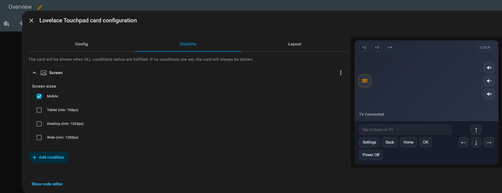
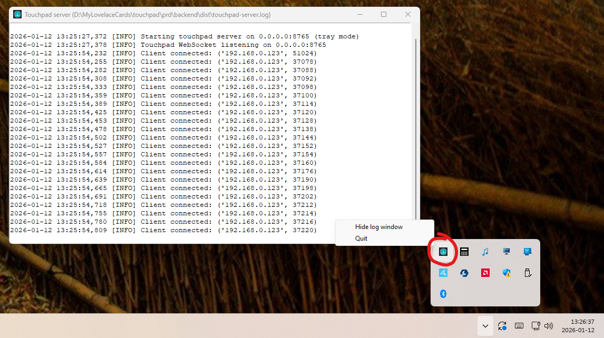

[](https://community.home-assistant.io/t/lovelace-touchpad-card-for-home-assistant-windows-os-touchpad/966857)
[](https://github.com/michalowskil/lovelace-touchpad-card/discussions)
[](https://github.com/michalowskil/lovelace-touchpad-card/releases)

# Lovelace Touchpad Card for Home Assistant

Control your PC or LG webOS TV from Home Assistant with a touchpad, keyboard input, and volume controls.

If you like this project, please consider giving it a ⭐ on GitHub: [](https://github.com/michalowskil/lovelace-touchpad-card/stargazers)

## Features & gestures
- One-finger move; tap/double-tap = left/double click; press-and-hold then drag to select/drag.
- Two-finger scroll with configurable multiplier.
- Two-finger short tap = right click.
- Keyboard panel for text input plus arrows/Home/End/PageUp/PageDown.
- Built-in volume controls (up/down/mute).
- Speed toggles x2/x3/x4 (one active at a time).
- Remembers selected toggles (speed, lock, keyboard panel) per view.
- Works over LAN WebSocket (`ws://...`); switch to `wss://` for remote.

## Installation

### HACS – Custom repository
1. HACS → ⋮ → **Custom repositories** → add  
   `https://github.com/michalowskil/lovelace-touchpad-card` (Type: **Dashboard**)  
   or click: [](https://my.home-assistant.io/redirect/hacs_repository/?owner=michalowskil&repository=lovelace-touchpad-card&category=plugin)
2. Install **Lovelace Touchpad Card**.
3. Resource is added automatically as `/hacsfiles/lovelace-touchpad-card/touchpad-card.js`.
4. Hard refresh the browser if needed.

### Manual
1. Download `touchpad-card.js` from the latest release and place it under  
   `config/www/touchpad-card/touchpad-card.js`.
2. Add a resource in **Edit Dashboard → Manage resources**:  
   `/local/touchpad-card/touchpad-card.js` (type: **JavaScript module**).
3. Hard refresh the browser.

## Usage
Add the card in the UI and configure everything from the visual editor.

## Windows server

1. Download `touchpad-server.exe` from the latest release on GitHub.
2. Run:
   ```powershell
   touchpad-server.exe --host 0.0.0.0 --port 8765
   ```
   - Starts directly in the system tray. Double-click the tray icon (or use the first menu item) to show/hide the log window. Closing/minimizing that window only hides it; the server keeps running.
   - SmartScreen may show ```Windows protected your PC``` because the file is unsigned. Click **More info** → **Run anyway**, or build from source yourself if you prefer.
   - Host and port are optional; defaults are `0.0.0.0` and `8765`.
3. Allow it through Windows Firewall on first run so the card can connect.
4. To auto-start, place a shortcut to `touchpad-server.exe` in Startup or create a scheduled task.
5. Logs are written to `touchpad-server.log` next to the executable. Use the tray icon to view them live.

## webOS backend (Home Assistant add-on)

1. In Home Assistant go to **Settings -> Add-ons -> Add-on store -> ... -> Repositories** and add  
   `https://github.com/michalowskil/lovelace-touchpad-card`.
2. Install **webOS Pointer Bridge** from the add-on list.
3. Open the add-on configuration and list your TVs. Example:

   ```yaml
   tvs:
     - name: livingroom
       host: 192.168.0.129
       listen_port: 8777
       tv_port: 3001
       use_ssl: true
     - name: bedroom
       host: 192.168.0.6
       listen_port: 8778
       use_ssl: true
   ```

   - `listen_port` is where the Lovelace card connects. The add-on runs in host network, so use your HA host IP.
   - Client keys are stored per TV in `/data/keys/<name>.json` and survive restarts.
   - `origin` is optional; leave it unset/empty unless your TV rejects the default. If needed, set it to `https://www.lge.com`, or to `""` to send no Origin header.
4. Start the add-on and enable **Start on boot** and **Watchdog** if desired.
5. In each touchpad card set `wsUrl` to the matching port (for example `ws://homeassistant.local:8777`).

## Notes
- Card sends deltas in `requestAnimationFrame` (throttled); backend accumulates scroll into wheel steps.
- For remote/HTTPS, use `wss://` (e.g., reverse proxy). LAN can stay `ws://`.

## Changelog
- **Card (frontend):** latest v0.3.1 — see [CHANGELOG.md](CHANGELOG.md). Highlights: editor numeric fields easier to edit; defaults shown so blanks fall back sensibly.
- **Windows backend:** latest v0.4.0 — see [backend/CHANGELOG.md](backend/CHANGELOG.md). Highlights: Windows backend now ships as a tray-first `touchpad-server.exe` (no console); tray icon toggles the log window.
- **webOS add-on:** latest v0.3.1 — see [addon/webos-pointer-bridge/CHANGELOG.md](addon/webos-pointer-bridge/CHANGELOG.md). Highlights: smoother pointer at high sensitivity; gentler scrolling when multiplier is 1.

## Screenshots




