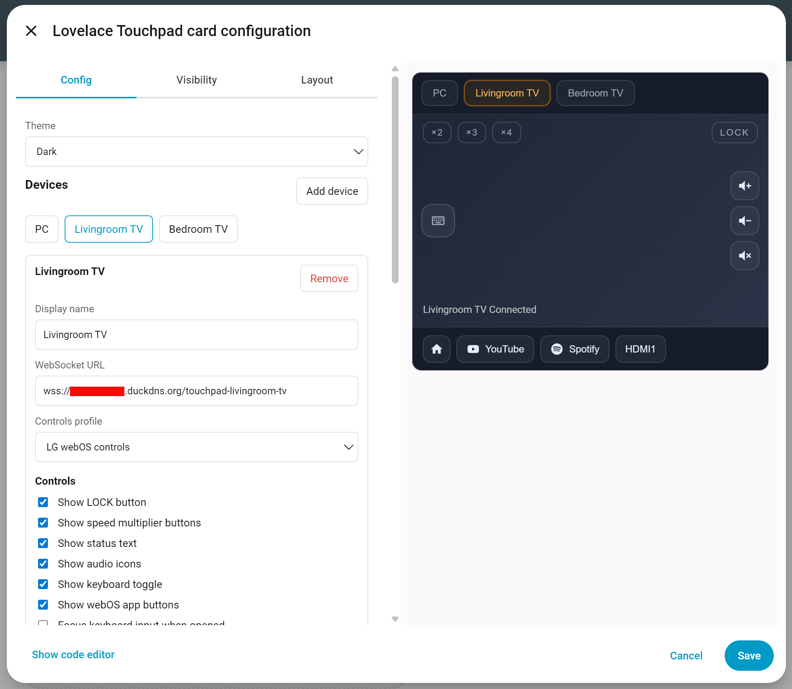
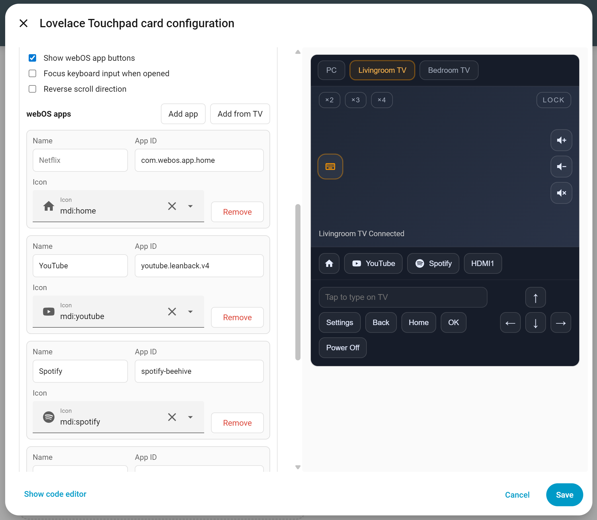
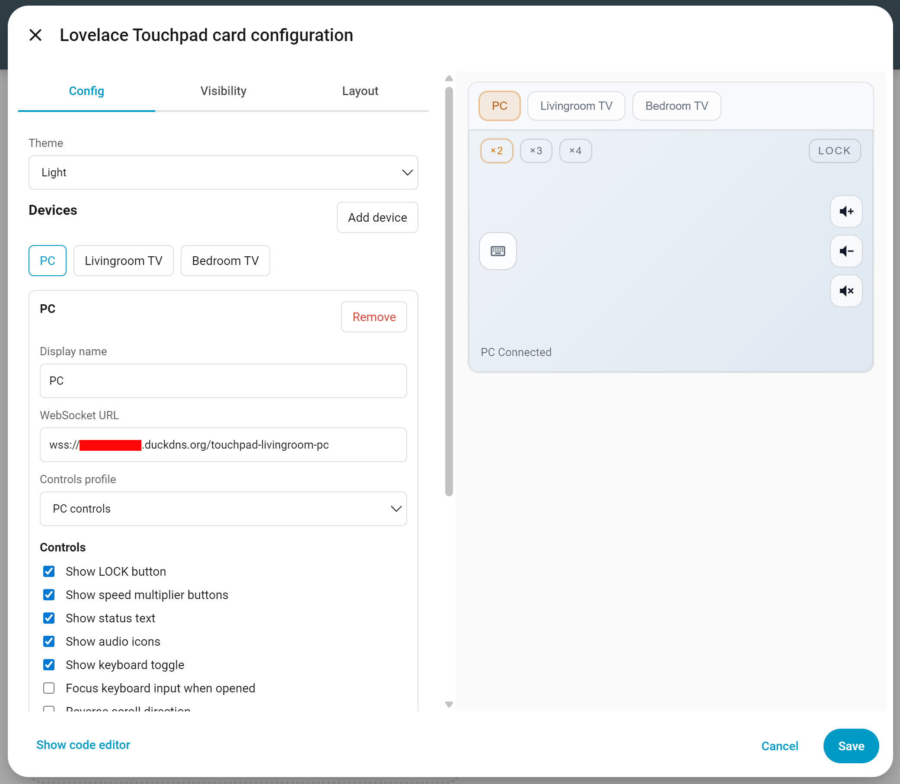
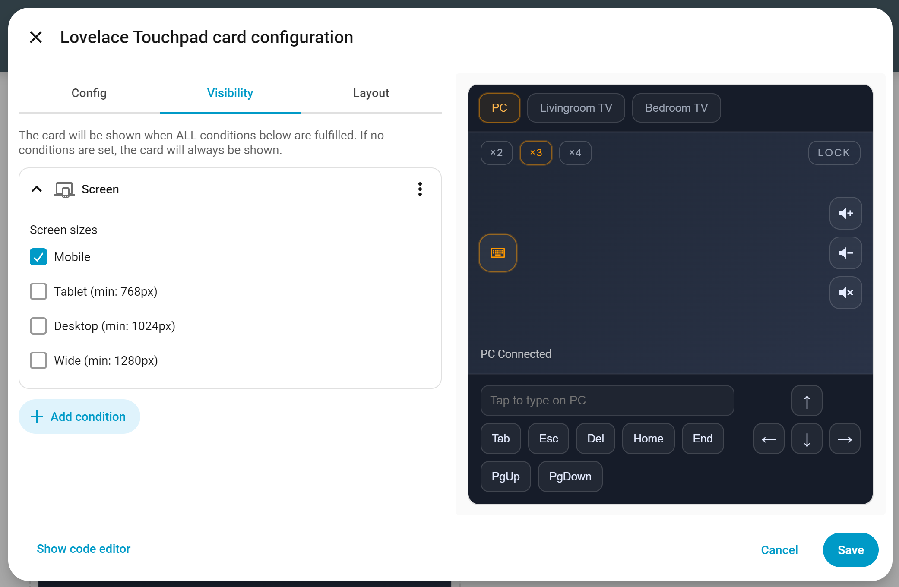
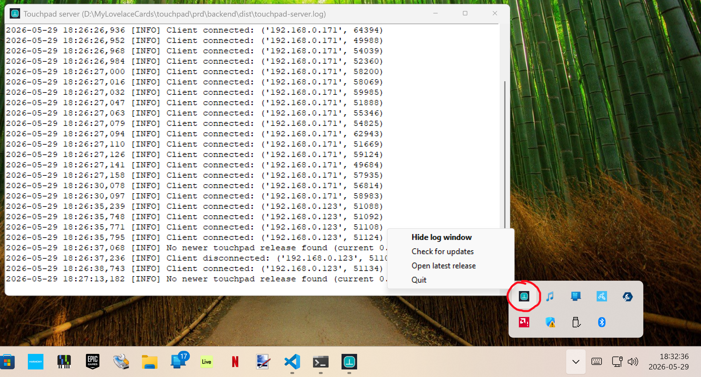

[](https://community.home-assistant.io/t/lovelace-touchpad-card-for-home-assistant-windows-os-touchpad/966857)
[](https://github.com/michalowskil/lovelace-touchpad-card/discussions)
[](https://github.com/michalowskil/lovelace-touchpad-card/releases)
[](https://github.com/michalowskil/lovelace-touchpad-card/releases/latest)

# Lovelace Touchpad Card

Control your PC or LG webOS TV from Home Assistant with a touchpad, keyboard input, and volume controls.

If you like this project, please consider giving it a ⭐ on GitHub: [](https://github.com/michalowskil/lovelace-touchpad-card/stargazers)

## Features & gestures
- One-finger move; tap/double-tap = left/double click; press-and-hold then drag to select/drag.
- Two-finger scroll with configurable multiplier.
- Two-finger short tap = right click.
- Keyboard panel for text input plus arrows/Home/End/PageUp/PageDown.
- Built-in volume controls (up/down/mute).
- Optional webOS app launcher buttons for services such as Netflix, Disney+, YouTube, and Prime Video.
- Speed toggles x2/x3/x4 (one active at a time).
- Optional multi-device mode with quick switching between configured endpoints.
- Remembers selected toggles (speed, lock, keyboard panel) per device and dashboard view.
- Works over LAN WebSocket (`ws://...`); switch to `wss://` for remote.

## Installation

### HACS – Custom repository
1. HACS → ⋮ → **Custom repositories** → add  
   `https://github.com/michalowskil/lovelace-touchpad-card` (Type: **Dashboard**)  
   or click: [](https://my.home-assistant.io/redirect/hacs_repository/?owner=michalowskil&repository=lovelace-touchpad-card&category=plugin)
2. Install **Lovelace Touchpad Card**.
3. Resource is added automatically as `/hacsfiles/lovelace-touchpad-card/touchpad-card.js`.
4. Hard refresh the browser if needed.

### Manual
1. Download `touchpad-card.js` from the latest release and place it under  
   `config/www/touchpad-card/touchpad-card.js`.
2. Add a resource in **Edit Dashboard → Manage resources**:  
   `/local/touchpad-card/touchpad-card.js` (type: **JavaScript module**).
3. Hard refresh the browser.

## Usage
Add the card in the UI and configure everything from the visual editor.

## Windows server

1. Download `touchpad-server.exe` from the [latest release](https://github.com/michalowskil/lovelace-touchpad-card/releases/latest) on GitHub.
2. Run `touchpad-server.exe`.
   - Starts directly in the system tray. Click the tray icon (or use the first menu item) to show/hide the log window. Closing/minimizing that window only hides it; the server keeps running.
   - SmartScreen may show ```Windows protected your PC``` because the file is unsigned. Click **More info** → **Run anyway**, or build from source yourself if you prefer.
   - Host and port are optional; defaults are `0.0.0.0` and `8765`. To override them, run for example: `touchpad-server.exe --host 0.0.0.0 --port 8765`.
3. Allow it through Windows Firewall on first run so the card can connect.
4. To auto-start, place a shortcut to `touchpad-server.exe` in Startup or create a scheduled task.
5. Logs are written to `touchpad-server.log` next to the executable. Use the tray icon to view them live.

## webOS backend (Home Assistant add-on)

1. In Home Assistant, go to Settings -> Apps -> Install app, open the three-dot menu, choose Repositories, and add:  
   `https://github.com/michalowskil/lovelace-touchpad-card`
2. Install **webOS Pointer Bridge** from the add-on list.
3. Open the add-on configuration and list your TVs. Example:

   ```yaml
   tvs:
     - name: livingroom
       host: 192.168.0.129
       listen_port: 8777
       tv_port: 3001
       use_ssl: true
     - name: bedroom
       host: 192.168.0.6
       listen_port: 8778
       use_ssl: true
   ```

   - `listen_port` is where the Lovelace card connects. The add-on runs in host network, so use your HA host IP.
   - Client keys are stored per TV in `/data/keys/<name>.json` and survive restarts.
   - `origin` is optional; leave it unset/empty unless your TV rejects the default. If needed, set it to `https://www.lge.com`, or to `""` to send no Origin header.
4. Start the add-on and enable **Start on boot** and **Watchdog** if desired.
5. In each touchpad card set `wsUrl` to the matching port (for example `ws://homeassistant.local:8777`).

## Optional webOS App Buttons

For a webOS device, set **Controls profile** to **LG webOS controls** and enable **Show webOS app buttons** in the card editor. The card then shows app buttons below the touchpad surface.

When the bridge can read the TV app list, buttons for apps that are not installed are shown dimmed. If the TV cannot provide that list, the buttons stay clickable; a failed launch shows a short message and dims that app for the current session.

You can add apps manually, or use **Add from TV** in the editor. **Add from TV** asks the configured bridge for the TV's installed app list. If the TV provides it, pick the apps you want to add; if it does not, keep using manual entries.

App IDs can vary between TV models, regions, or app version. Therefore, the card allows you to enter any app ID.

Each app needs `app_id` and at least one visible value: `name` or `icon`. That means all of these are valid:

```yaml
webos_apps:
  - name: YouTube
    app_id: youtube.leanback.v4
    icon: mdi:youtube
  - app_id: spotify-beehive
    icon: mdi:spotify
  - name: HDMI 1
    app_id: com.webos.app.hdmi1
```

## Remote access over HTTPS/WSS

If you open Home Assistant through HTTPS (for example DuckDNS + NGINX), do not use a plain `ws://...` URL in the card. Browsers treat that as mixed content: Home Assistant is secure, but the card opens an insecure WebSocket, so the page may show as **Not secure** and the connection may be blocked.

Both backends listen with plain WebSocket (`ws://`) on their local ports:

- Windows server: usually `ws://YOUR-PC-LAN-IP:8765`
- webOS Pointer Bridge add-on: for example `ws://YOUR-HA-LAN-IP:8778`

To use either backend remotely, put it behind your existing HTTPS reverse proxy and connect to it with `wss://`.

Example with the **NGINX Home Assistant SSL proxy** add-on:

1. In the NGINX add-on configuration, enable custom config files:

   ```yaml
   customize:
     active: true
     default: nginx_proxy_default*.conf
     servers: nginx_proxy/*.conf
   ```

2. Create one config file per backend in Home Assistant. For example:

   ```text
   /share/nginx_proxy_default_touchpad-livingroom-tv.conf
   /share/nginx_proxy_default_touchpad-pc.conf
   ```

   The filename matters. Files matching `nginx_proxy_default*.conf` are added inside the existing Home Assistant HTTPS server, so they may contain `location` blocks. Files under `/share/nginx_proxy/*.conf` are for complete `server { ... }` blocks and will fail if you put only a `location` block there.

3. Put a matching `location` block in each file. The path after `location` is the public WebSocket path you will use in the card. `proxy_pass` points to the real backend inside your LAN.

   Example for a TV bridge running on your Home Assistant host:

   ```nginx
   location /touchpad-livingroom-tv {
       proxy_pass http://192.168.0.123:8778;
       proxy_http_version 1.1;

       proxy_set_header Upgrade $http_upgrade;
       proxy_set_header Connection "upgrade";
       proxy_set_header Host $host;

       proxy_read_timeout 86400;
   }
   ```

4. Restart the NGINX add-on.

5. In the touchpad card, use the HTTPS WebSocket URL that matches your `location` path:

   ```yaml
   wsUrl: wss://your-domain.duckdns.org/touchpad-livingroom-tv
   ```

For remote access, you only need to expose your HTTPS port (usually `443`) to the internet. Do not expose backend ports (for example `8765` or `8778`) directly unless you understand the risk: these WebSocket backends do not add their own login screen.

## Changelog
- **Card (frontend):** latest v0.8.0 — see [CHANGELOG.md](CHANGELOG.md). Highlights: fullscreen touchpad mode plus repositioned status, keyboard, and fullscreen controls for mobile use.
- **Windows backend:** latest v0.5.1 — see [backend/CHANGELOG.md](backend/CHANGELOG.md). Highlights: tray update checks now track the Windows backend version, so card-only releases do not notify Windows users.
- **webOS add-on:** latest v0.4.0 — see [addon/webos-pointer-bridge/CHANGELOG.md](addon/webos-pointer-bridge/CHANGELOG.md). Highlights: app launch support plus installed-app reporting for the card editor picker.

## Screenshots






